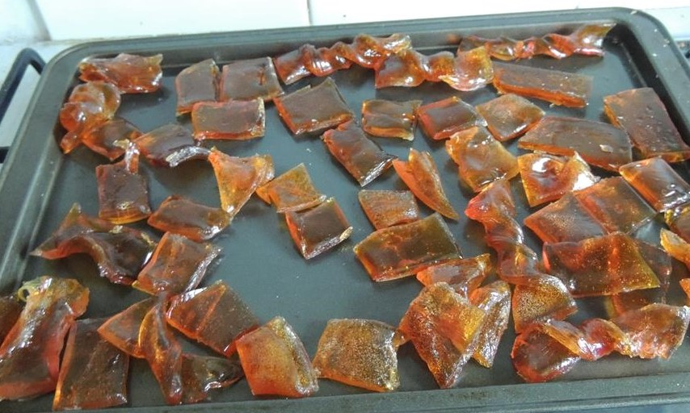

# Barley Sugar

---

## 📜 Barley Sugar Quick Reference (Printable Card)

**What it is:**  
A traditional candy made by boiling sugar with barley water until hard crack stage.  

**How to Make (Basic Modern):**  
1. Make barley water by simmering barley in water, strain.  
2. Boil sugar with barley water until hard crack stage.  
3. Pour onto greased surface, cut into sticks.  

**Historical Use:**  
- Popular Victorian sweet.  
- Sometimes medicinal lozenge.  

**Modern Use:**  
- Heritage candy, sometimes sold in specialty shops.  

---

## Cross References  
- [Barley](barley.md)  
- [Cookery Index](../../cookery.md)  
