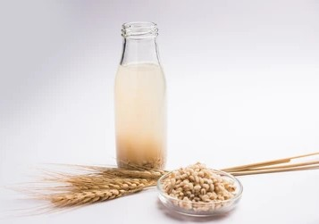

# Barley Water

---

## 📜 Barley Water Quick Reference (Printable Card)

**What it is:**  
A soothing drink made by simmering barley in water, often with lemon and honey.  

**How to Make (Basic Modern):**  
1. Simmer pearl barley in water until liquid is milky.  
2. Strain.  
3. Add lemon juice and honey (optional).  

**Historical Use:**  
- Roman and medieval medicine as a cooling drink.  
- Common in early hospitals.  

**Modern Use:**  
- Health and hydration drink.  
- Still used in home remedies.  

---

## Cross References  
- [Barley](barley.md)  
- [Cookery Index](../../cookery.md)  
