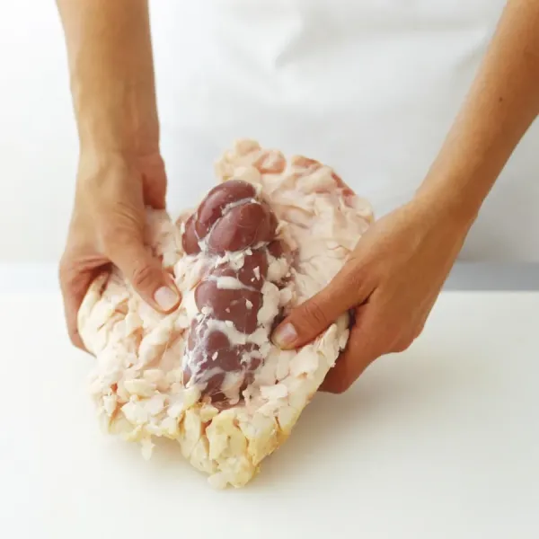

# Suet

---

## 📜 Suet Quick Reference (Printable Card)

**What it is:**  
Raw, hard fat from beef or mutton, found around the kidneys and loins.  

**How to Make (Basic Modern):**  
1. Trim away meat, membranes, and blood.  
2. Cut into small cubes or shred.  
3. Slowly render over low heat until liquid.  
4. Strain through cheesecloth.  
5. Cool until solid.  

**Historical Use:**  
- Preserving meat (potted beef, pemmican).  
- Binding puddings and pastries.  
- Fuel for candles, lamps, and even soap-making.  

**Modern Use:**  
- Traditional British puddings (spotted dick, steak & kidney).  
- Bird food (suet cakes).  
- Pastry enrichment.  
- Survival ration mixes.  

---

## What is Suet?  

Suet is the **hard, raw fat** from beef or mutton, specifically from around the **kidneys and loins**. Unlike softer fats (like lard or tallow), suet has a high melting point and firm texture, which historically made it ideal for long-lasting storage, pastry making, and food preservation.  

When rendered (melted and strained), suet becomes **tallow**, a shelf-stable fat used in both cooking and non-food survival applications.  

---

## Historical Preparation  

1. **Harvesting:**  
   Traditionally, butchers reserved the fat from cattle or sheep kidneys. This was valued more highly than general fat scraps.  

2. **Processing:**  
   - Suet was chopped finely or shredded by hand.  
   - To prevent spoilage, it was often **rendered immediately**, turning into tallow.  
   - Unrendered suet could be stored short-term in cool weather or salted to extend life.  

3. **Preservation:**  
   - Rendered suet (tallow) could be sealed in crocks or jars with additional suet poured over to exclude air.  
   - Some methods sealed jars with **melted suet instead of wax** to preserve food inside.  

4. **Historical Uses:**  
   - **Food:**  
     - Potted meats (layered and sealed with suet).  
     - Portable soup (a dried, concentrated broth).  
     - Pemmican (Native American/Canadian mix of dried meat, fat, and berries).  
     - Suet puddings and dumplings.  
   - **Non-Food:**  
     - Candles, lamp oil, soap, leather treatment.  

---

## Modern Preparation  

1. **Trimming:**  
   - Obtain beef suet (from butcher or specialty shops).  
   - Remove membranes and connective tissue.  

2. **Chopping or Grating:**  
   - Cut into small pieces or shred.  
   - For pastry, fresh suet is sometimes frozen and grated directly into dough.  

3. **Rendering into Tallow:**  
   - Place in a heavy pot or slow cooker on **very low heat**.  
   - Slowly melt, stirring occasionally.  
   - Strain liquid fat through cheesecloth.  
   - Pour into jars or molds to cool.  

4. **Storage:**  
   - Raw suet spoils quickly—best frozen if not used immediately.  
   - Rendered tallow keeps for months in sealed containers at room temp, longer if refrigerated.  

---

## Uses Today  

- **Cooking & Baking:**  
  - Suet crust pastries (traditional British savory pies).  
  - Christmas pudding, spotted dick, and steamed puddings.  
  - Enriches dough with a distinctive lightness.  

- **Survival & Homesteading:**  
  - Ingredient in homemade pemmican.  
  - Base for fat-based emergency rations.  
  - Traditional preservation (sealing foods).  

- **Wildlife & Outdoors:**  
  - Bird suet cakes (mixed with seeds, berries, nuts).  
  - Fire starter when mixed with dry material.  

- **Other Uses:**  
  - Homemade soap.  
  - Candle making.  
  - Leather waterproofing.  

---

## Cross References  
- [Tallow](tallow.md)  
- [Potted Beef](potted-beef.md)  
- [Pemmican](pemmican.md)  
- [Portable Soup](portable-soup.md)  
- [Food Preservation](food-preservation.md)  

---

*This page is printable and can be saved as PDF for offline use.*
