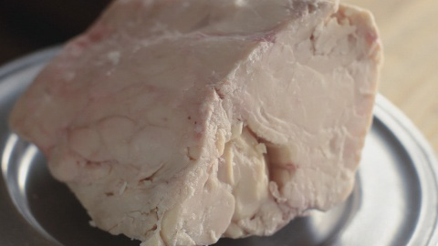
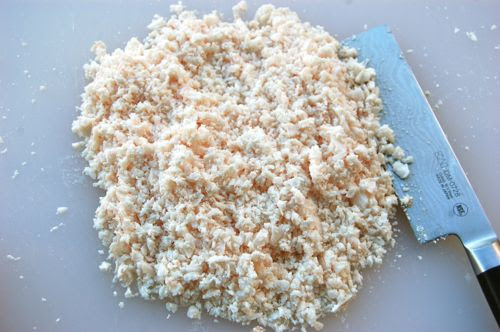

# Suet

---

## 📜 Suet Quick Reference (Printable Card)

**What it is:**  
Raw, hard fat from beef or mutton, found around the kidneys and loins.  

**How to Make (Basic Modern):**  
1. Trim away meat, membranes, and blood.  
2. Cut into small cubes or shred.  
3. Slowly render over low heat until liquid.  
4. Strain through cheesecloth.  
5. Cool until solid.  

**Historical Use:**  
- Preserving meat (potted beef, pemmican).  
- Binding puddings and pastries.  
- Fuel for candles, lamps, and even soap-making.  

**Modern Use:**  
- Traditional British puddings (spotted dick, steak & kidney).  
- Bird food (suet cakes).  
- Pastry enrichment.  
- Survival ration mixes.  

---

## What is Suet?  

Suet is the **hard, raw fat** from beef or mutton, specifically from around the **kidneys and loins**. Unlike softer fats (like lard or tallow), suet has a high melting point and firm texture, which historically made it ideal for long-lasting storage, pastry making, and food preservation.  

When rendered (melted and strained), suet becomes **tallow**, a shelf-stable fat used in both cooking and non-food survival applications.  

---

## Historical Preparation  

1. **Harvesting:** Traditionally, butchers reserved the fat from cattle or sheep kidneys.  
2. **Processing:** Finely chopped or shredded; often rendered immediately.  
3. **Preservation:** Rendered suet (tallow) sealed in crocks or jars; melted suet sometimes used to seal jars of food.  
4. **Uses:** Potted meats, portable soup, pemmican, puddings; plus candles, lamp oil, soap.  

---

## Modern Preparation  

1. **Trimming:** Obtain beef suet; remove membranes/connective tissue.  
2. **Chop/Grate:** Small pieces or freeze & grate for pastry.  
3. **Render:** Very low heat in pot/slow cooker; strain; cool.  
4. **Storage:** Raw suet freezes well; rendered tallow stores for months.  

---

## Uses Today  

- **Cooking:** Suet crust pies, steamed puddings.  
- **Survival:** Pemmican ingredient; sealing preserved foods.  
- **Outdoors:** Bird suet cakes, fire starter.  
- **Other:** Soap, candles, leather waterproofing.  

---

## Cross References  
- [Tallow](tallow.md)  
- [Potted Beef](../preservation/foods/potted-beef.md)  
- [Pemmican](../preservation/foods/pemmican.md)  
- [Portable Soup](../preservation/foods/portable-soup.md)  
- [Preservation Index](../../preservation.md)  
- [Cookery Index](../../cookery.md)  

---

*This page is printable and can be saved as PDF for offline use.*
