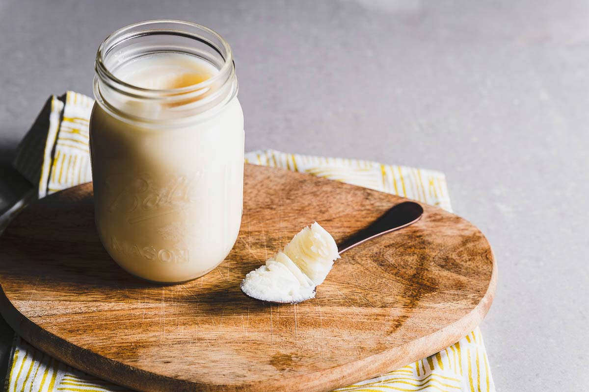
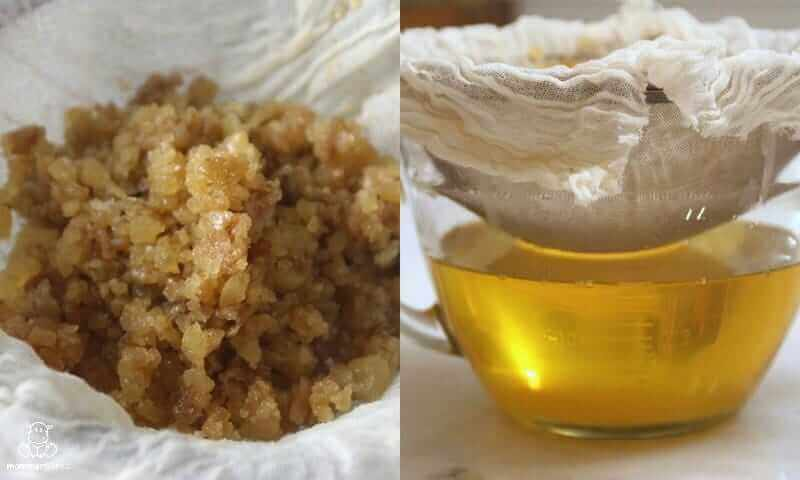

# Tallow

---

## 📜 Tallow Quick Reference (Printable Card)

**What it is:**  
Rendered and purified suet (beef or mutton fat). Shelf-stable, firm at room temperature.  

**How to Make (Basic Modern):**  
1. Chop suet or beef/mutton fat.  
2. Heat slowly over very low heat until liquid.  
3. Strain through cheesecloth.  
4. Cool and store in jars.  

**Historical Use:**  
- Food preservation (sealing meats in pots).  
- Cooking fat and pastry.  
- Candles, soap, lamps, leather treatment.  

**Modern Use:**  
- Frying and baking.  
- Keto/ancestral cooking.  
- Soap and candle making.  
- Emergency survival fuel.  

---

## What is Tallow?  

Tallow is **rendered beef or mutton fat**, usually made from **suet** (the hard fat around kidneys). Once melted down and strained, it becomes a shelf-stable, waxy fat central to cooking, lighting, and survival.  

---

## Historical Preparation  

- Finely chopped fat melted over low fire; impurities skimmed; strained.  
- Stored in crocks/barrels; used to seal potted meats.  

---

## Modern Preparation  

- Cut into cubes; render in slow cooker/oven/heavy pot on very low heat; strain.  
- Store sealed at room temp (months) or refrigerate/freeze longer.  

---

## Uses Today  

- **Cooking:** Frying oil (high smoke point), pastries, base for pemmican.  
- **Survival:** Preservation (potted beef), energy-dense ration, fire starter.  
- **Non-Food:** Soap, candles, leather treatment, light rust prevention.  

---

## Cross References  

- [Suet](suet.md)  
- [Potted Beef](../preservation/foods/potted-beef.md)  
- [Pemmican](../preservation/foods/pemmican.md)  
- [Portable Soup](../preservation/foods/portable-soup.md)  
- [Preservation Index](../../preservation.md)  
- [Cookery Index](../../cookery.md)  

---

*This page is printable and can be saved as PDF for offline use.*
