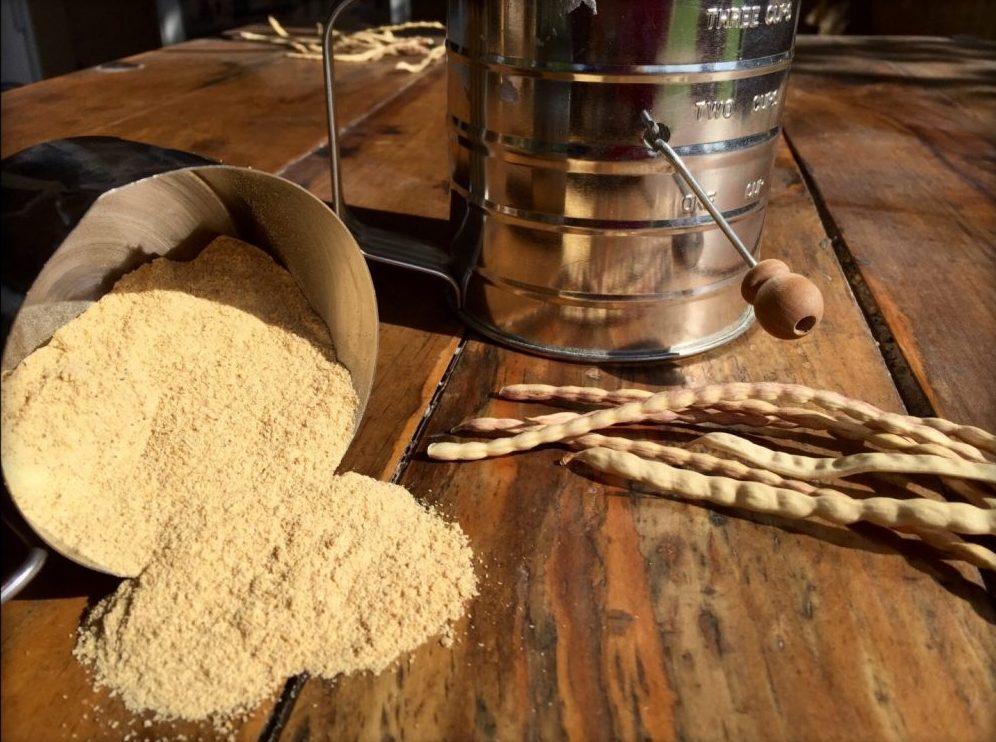

# Mesquite Flour

## Overview
**Mesquite flour** is a naturally sweet, nutty flour made by grinding the dried seed pods of the mesquite tree (*Prosopis* species). It has been used for centuries by Indigenous peoples of the Americas as a staple food and survival ingredient. Rich in protein, fiber, and minerals, it can be eaten on its own or blended with other flours.

---
![[mesquite_honey150.jpg]]
## Source
- **Tree:** Mesquite trees grow in arid and semi-arid regions, especially in the American Southwest, Mexico, South America, and parts of Africa and India.  
- **Pods:** The long, tan seed pods are harvested when fully dried on the tree.  
- **Preparation:**  
  1. Collect dried pods.  
  2. Clean and break into pieces.  
  3. Grind into a fine powder (traditionally with stone mills; modernly with grain mills or high-powered blenders).  

### Practice Safe Harvesting and Storage
![[drymesquite.jpeg]]
1. **Always pick dry, mature seed pods.**
2. **Never pick mature mesquite pods if they have been exposed to rain once dry.**
3. **Only pick mesquite pods from the tree or when freshly fallen.**
4. **Always completely dry mesquite pods before storage in airtight containers.**
---

## Flavor & Nutrition
- **Flavor:** Sweet, nutty, with caramel/molasses notes.  
- **Nutrients:** High in fiber, calcium, magnesium, potassium, and lysine (an essential amino acid often lacking in grain flours).  
- **Sweetness:** Naturally sweet — often reduces need for added sugar in recipes.  

---

## Uses
- **Baking:**  
  - Blended with wheat or other flours in breads, pancakes, muffins.  
  - Adds natural sweetness and flavor.  
- **Thickener:** Works well in soups, stews, porridges.  
- **Beverages:** Traditionally mixed with water or milk for a sweet, sustaining drink.  
- **Survival Food:** Can be eaten directly as a meal replacement due to high nutrition and energy content.  

---

## Preservation & Storage
- **Shelf Life:** 6–12 months if kept dry.  
- **Storage:** Airtight container, cool and dark place.  
- **Traditional Preservation:** Pods could be stored whole in woven baskets or sacks and ground as needed.  

---

## Historical & Survival Importance
- **Indigenous Use:** Native peoples in North and South America relied on mesquite flour as a staple during times of scarcity.  
- **Trade:** Ground pods and flour were often traded between communities.  
- **Resilience:** Mesquite trees thrive in harsh climates, making the pods a dependable food source during droughts or famine.  

---

## Notes
- Gluten-free, making it suitable for celiac and gluten-intolerant diets.  
- Because of natural sweetness, mesquite flour is rarely used as the sole flour in baked goods — typically 20–30% of total flour blend.  
- High fiber content can make baked goods dense if not balanced with lighter flours.  

---

## Related Pages
- [Flour](flours.md)  
- [Zucchini Flour](zucchini-flour.md)  
- [Drying & Dehydrating](../techniques/drying-and-dehydrating.md)  
- [Preservation](../preservation/index.md)  
- [Cookery](../cookery/index.md)
