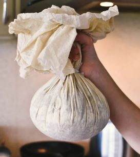

# Pudding Cloth

## Overview
A **pudding cloth** is a piece of strong, plain-woven cotton or linen fabric used to boil or steam traditional puddings before the widespread availability of modern bakeware. The cloth holds the pudding mixture together while cooking, giving it a characteristic round or dome shape.  

The method was common in England and Europe during the 17th–19th centuries and is still used today for traditional recipes such as Christmas pudding, spotted dick, and suet puddings.  

---

## What It Is
![[1-pudding-cloth.jpg]]
- A square or rectangle of plain-woven cotton, muslin, or linen.  
- Typically hemmed at the edges to prevent fraying.  
- Size varies depending on the pudding, but often ranges from 45–75 cm (18–30 inches) square.  
- Reusable if properly cleaned and stored.  

---

## Preparing a Pudding Cloth
1. **Scald the Cloth:**  
   Place the cloth in boiling water for a few minutes to sterilize and soften.  

2. **Flour the Cloth:**  
   While damp, sprinkle flour over the inside surface. Shake off excess.  
   - The flour forms a thin skin that prevents sticking and helps the pudding set.  

3. **Butter (Optional):**  
   Some cooks also butter the cloth before flouring for added non-stick protection.  

---

## Using a Pudding Cloth
1. **Place the Mixture:**  
   - Spread the pudding mixture (such as suet pudding) onto the center of the prepared cloth.  
   - Leave room for the pudding to expand.  

2. **Gather and Tie:**  
   - Bring the corners of the cloth together around the pudding.  
   - Tie firmly with kitchen string, leaving some slack for expansion.  
   - Ensure there are no gaps for mixture to escape.  

3. **Cooking:**  
   - Lower the pudding bundle into a pot of boiling water or steamer.  
   - Simmer gently for the required time (often several hours).  
   - Keep the pudding fully submerged, topping up with hot water as needed.  

4. **Unwrapping:**  
   - Remove and let cool slightly.  
   - Untie and carefully peel away the cloth.  
   - The pudding will have a firm, rounded surface.  

---
![[2-pudding-cloth.jpg]]
## Care and Maintenance
- Wash the cloth thoroughly after use with hot water and mild soap.  
- Rinse well to remove all soap residues.  
- Boil again before the next use to sterilize.  
- Store in a dry place to prevent mildew.  

---

## Advantages
- Produces a traditional texture and shape.  
- Reusable and eco-friendly compared to disposable molds.  
- Versatile — suitable for both sweet and savory puddings.  

---

## Related Pages
- [Spotted Dick](../cookery/food/spotted-dick.md)  
- [Suet Pudding](../cookery/food/suet-pudding.md)  
- [Preservation](../preservation/index.md)  
- [Cookery](../cookery/index.md)  
